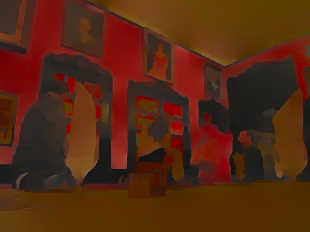
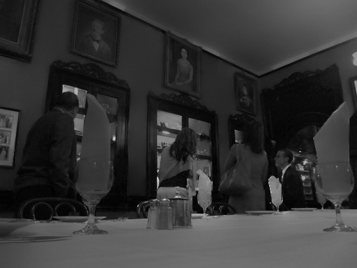
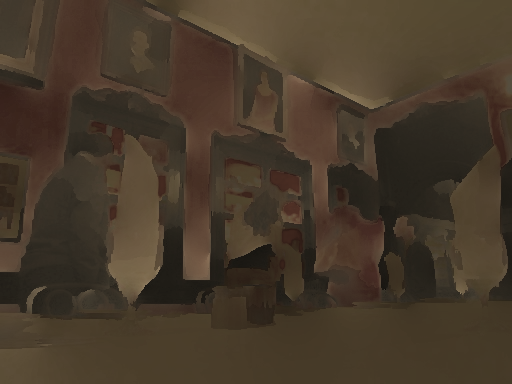
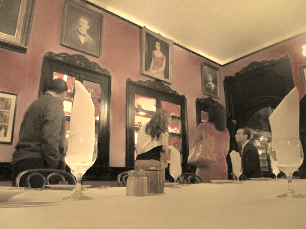

# CS7180: Decompose and Relight - Intrinsic Image Separation with Automatic Light Detection

**Authors:** Vaibhav Thalanki, Oliver Fritsche, Sai Manichandana Devi Thumati  
**Institution:** Khoury College of Computer Sciences, Northeastern University

## Overview

This project implements an intrinsic image decomposition pipeline inspired by [Garces et al. (2012)](https://elenagarces.es/pdf_papers/Garces_2012.pdf) that separates photographs into reflectance (surface color) and shading (illumination) components. The pipeline uses SLIC superpixel segmentation with KMeans clustering and solves a sparse linear system balancing reflectance consistency and edge-aware shading smoothness.

## Features

- **Intrinsic Decomposition**: Separates images into reflectance and shading using clustering-based approach
- **Sepia Tone Transform**: Applies artistic sepia effect to reflectance component
- **Automatic Light Detection**: Point-light simulation with automatic light source detection (Lopez-Moreno et al. 2010)
- **Directional Lighting**: Simulates lighting from right edge
- **Photorealistic Composition**: Linear RGB space composition with automatic exposure adjustment

## Pipeline

1. Decompose input image into reflectance (R) and shading (S)
2. Apply sepia stylization to R
3. Relight S using point-auto or directional mode
4. Recompose in linear space with automatic exposure correction

## Results

### Decomposition Components
<table>
  <tr>
    <td><br/><i>Original Reflectance</i></td>
    <td><br/><i>Original Shading</i></td>
  </tr>
</table>

### Transform and Relighting
<table>
  <tr>
    <td><br/><i>Sepia-transformed Reflectance</i></td>
    <td><br/><i>Relit Shading (Point-Auto)</i></td>
  </tr>
</table>

### Final Result
<table>
  <tr>
    <td><br/><i>Final Combined Output (Point-Auto Relighting)</i></td>
  </tr>
</table>

## Usage

```bash
python run_pipeline.py <image_path> [options]
```

**Options:**
- `--mode {point_auto,directional_right}` - Relighting mode (default: point_auto)
- `--out_dir PATH` - Output directory (default: ./outputs)
- `--clusters K` - Number of KMeans clusters (default: 10)
- `--n_segments N` - Number of SLIC superpixels (default: 600)
- `--sepia FLOAT` - Sepia intensity 0-1 (default: 0.85)

**Example:**
```bash
python run_pipeline.py input_image3.jpg --mode point_auto --out_dir ./outputs
```

The script generates decomposition and relighting results in the specified output directory.

## Project Structure

```
intrinsic/          # Decomposition module
relight/            # Relighting modules (point, directional, compose)
utils/              # Color space utilities
outputs/            # Generated results
```

## Parameters

- Superpixels: 600 segments, compactness 10.0
- KMeans clusters: K=10
- Smoothness: λ=0.2, σ=0.1
- Sepia intensity: t=0.85

## Limitations

Since this is a classical (non-learning) approach, new shadows do not form when introducing artificial light sources. Modern deep learning methods address this limitation by learning shadow formation implicitly.

## Dataset

Images sourced from [Intrinsic Images in the Wild](http://opensurfaces.cs.cornell.edu/intrinsic/) (Bell, Bala, and Snavely 2014), a large-scale public dataset with crowdsourced material property annotations.